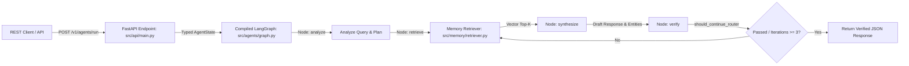

# Autonomous Reasoning Agents System Specification (`spec.md`)

## 1. System Overview
The `autonomous-reasoning-agents` repository implements a neuro-symbolic, graph-directed autonomous reasoning engine (`langgraph`) coupled with an async retrieval-augmented generation (RAG) memory store (`sentence-transformers`) and exposed via a production-hardened `FastAPI` REST interface.

## 2. Architectural Boundaries & Data Flow

## 3. Data Schema & Contracts (`AgentState`)
The core state object passed between graph nodes must conform to the `AgentState` TypedDict:
- `user_query`: `str` — Raw prompt received from consumer.
- `reasoning_plan`: `list[str]` — Step-by-step targets generated by `analyze_query_node`.
- `retrieved_context`: `str` — Formatted top-k semantic search matches from `retriever.py`.
- `extracted_domain_entities`: `dict[str, Any]` — Structured entities identified during synthesis.
- `draft_response`: `str` — Candidate natural language answer.
- `verification_passed`: `bool` — Audit status returned by `verify_precision_node`.
- `iterations`: `int` — Monotonically increasing loop counter bounded at `3`.

## 4. API Endpoint Specification (`FastAPI`)
### `POST /v1/agents/run`
- **Request Body JSON**: `{"query": "User question or prompt string"}`
- **Response JSON**: `{"status": "success", "iterations": <int>, "draft_response": "<string>", "extracted_domain_entities": <dict>}`
- **Error Handlers**: Returns `400 Bad Request` if `query` is empty or invalid; `500 Internal Server Error` with sanitized tracebacks on runtime exception.
