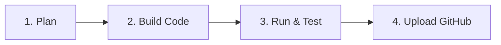

# Enterprise Development Protocol & Lifecycle

This document establishes the mandatory engineering protocol for the **Autonomous Memory & Reasoning Agents** repository going forward. All developers and AI pair programmers must strictly adhere to this 4-step lifecycle before committing code to production branches.

---

## 🏛️ Standardized 4-Step Workflow



### Step 1: Plan Before Executing
- **Requirement**: Never write code or mutate repository state without an approved implementation plan.
- **Protocol**: Generate a structured markdown artifact (`implementation_plan.md`) outlining architectural changes, API contracts, data models, and verification steps.
- **Approval**: Present the plan to the user/reviewer and await explicit confirmation (`"proceed"`) before making modifications.

### Step 2: Build Modular Code
- **Language**: Python 3.13+
- **Frameworks**: LangGraph (StateGraph workflows), FastAPI (Async web server), RQ (Redis Queue out-of-band workers), sentence-transformers (Embeddings).
- **Standards**:
  - Implement strong type hinting (`typing` / `Pydantic`).
  - Maintain docstring integrity across all modules.
  - Decouple heavy parsing and OCR ingestion from blocking synchronous server threads.

### Step 3: Run & Test in Local Virtual Environment
- **Requirement**: All changes must be verified against automated unit tests and benchmark suites prior to staging.
- **Protocol**:
  1. Ensure local virtual environment is active (`.venv\Scripts\activate`).
  2. Execute unit test suite:
     ```powershell
     python run_tests.py
     ```
  3. Execute domain extraction precision benchmark verifying target performance metrics (+42% lift):
     ```powershell
     python eval/benchmark.py
     ```
- **Exit Condition**: Zero runtime errors or failing assertions.

### Step 4: Upload to GitHub
- **Requirement**: Maintain atomic commits and clean git history.
- **Protocol**:
  1. Verify `.gitignore` excludes `.venv`, `.env`, binary vector indices (`*.index`), and `__pycache__`.
  2. Stage modified files:
     ```powershell
     git add .
     ```
  3. Commit with conventional commit prefixes (`feat:`, `fix:`, `refactor:`, `docs:`):
     ```powershell
     git commit -m "feat: descriptive commit message"
     ```
  4. Push to remote origin repository:
     ```powershell
     git push -u origin main
     ```

---

## 🔒 Security & Factory Defaults
- **API Headers**: GitHub-only header policy for public documentation.
- **Secrets**: Never commit actual AWS credentials or Redis production URIs; always use `.env.example` templates.
